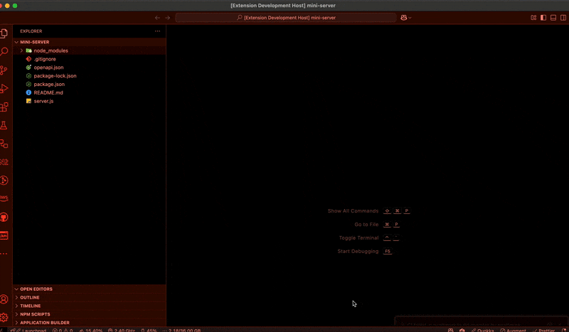

# CI Theme Watcherer

🔴 **CI Theme Watcher** is a lightweight VSCode extension that monitors your GitHub CI pipeline via [Ably](https://ably.com) and visually alerts you by switching your theme to a red alert theme (like [`redalertish`](https://marketplace.visualstudio.com/items?itemName=sjsepan.sjsepan-redalertish)) when a workflow fails.



---

## 🚀 Features

- ✅ Listens to CI failure events in real-time using Ably
- 🎨 Automatically switches your VSCode theme on CI failure
- 🔄 Saves and restores your original theme
- ⚙️ Fully configurable Ably key and theme name via settings
- 🪄 Includes a command to restore the original theme manually

---

## 🛠 Configuration

Open **Settings** → **CI Theme Watcher** or edit your `settings.json`:

```json
{
  "ciThemeWatcher.ablyKey": "your-public-ably-key",
  "ciThemeWatcher.themeName": "Redalertish"
}
```

> 🔐 Only use a **public read-only Ably key** here.  
> You can create one in your Ably dashboard by setting read-only access to the `ci-events` channel.

---

## 📦 Theme Dependency

This extension depends on the [**Redalertish**](https://marketplace.visualstudio.com/items?itemName=sjsepan.sjsepan-redalertish) theme.

It will prompt for installation if missing, or you can install it manually:

```bash
code --install-extension sjsepan.sjsepan-redalertish
```

---

## 🧰 GitHub Action Setup

To send CI failure notifications, add this to your GitHub Actions workflow.

### 1. Add Ably API Key to Secrets

1. Go to your GitHub repo → **Settings → Secrets and variables → Actions**
2. Add a new secret named: `ABLY_API_KEY`
3. Use your **full Ably API key** in the format:
   ```
   appId.key:secret
   ```

### 2. Update Your `.github/workflows/ci.yml`

Here's a full example:

```yaml
name: CI with Ably Notification

on:
  push:
    branches: [main]
  pull_request:

jobs:
  test:
    runs-on: ubuntu-latest
    steps:
      - name: Checkout code
        uses: actions/checkout@v3

      # Simulated failure (replace with your actual build/test logic)
      - name: Simulate failure
        run: |
          echo "Pretending this failed..."
          exit 1

      - name: Notify via Ably
        if: failure()
        run: |
          curl -u "$ABLY_API_KEY"             -X POST "https://rest.ably.io/channels/ci-events/messages"             -H "Content-Type: application/json"             -d '{
              "name": "workflow_failed",
              "data": {
                "message": "GitHub Action failed",
                "user": "'"${{ github.actor }}"'",
                "repo": "'"${{ github.repository }}"'",
                "run_id": "'"${{ github.run_id }}"'"
              }
            }'
        env:
          ABLY_API_KEY: ${{ secrets.ABLY_API_KEY }}
```

> ✅ This step will notify your extension in real-time when a workflow fails.

---

## 🧪 Commands

- `Restore Original Theme`  
  Reverts to the theme that was active before the CI failure.  
  Run it anytime from the **Command Palette** (`Cmd+Shift+P` / `Ctrl+Shift+P`).

---

## 🙌 Credits

Built with ❤️ by Nir + ChatGPT using:

- [Ably Realtime](https://ably.com/)
- [VSCode Extension API](https://code.visualstudio.com/api)
- [Redalertish Theme](https://marketplace.visualstudio.com/items?itemName=sjsepan.sjsepan-redalertish)

---

## 📄 License

MIT
